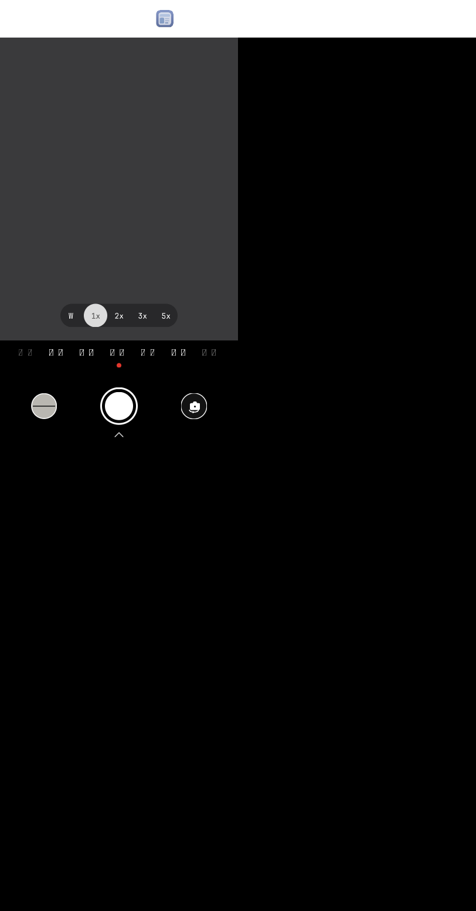

# Camera card

The Mate 70 Air camera replica's photo-mode screen, packaged as an OctoSense
**card app**: a bundle of L0 card text, data, a kit and its artwork that
OctoSense renders in its own sandboxed isolate. No native code.



## Layout

```
camera-card/
  manifest.json     identity, version, what the app may do (signed by the publisher)
  page.card         the L0 card
  page.data.json    the bound data; artwork by bundle-relative path
  kit/              the kit the card is lowered with
  assets/           six SVG icons, shipped with the app
```

## What it is allowed to do

Nothing beyond drawing its screen. The manifest requests no capabilities and
no hosts, 256 KB of storage, a budget of five million script instructions and
a 32 MB heap. The OctoSense store shows exactly this to a person before they
install.

## Publishing

See `AGENTS.md` for the rules and commands. This app was checked, scanned and
published with:

```sh
hub stamp camera-card
hub sign-manifest camera-card --key ~/.octosense/publisher-keys/ymote.key --key-id ymote
hub check camera-card --publisher-key ymote=<public key>
```

It is listed in the hub at https://github.com/ymote/octosense-app-hub.

## Source

The card was compiled by the image-to-appcard flow from the storyboard in
`Octoscript-AppCard`, `apps/camera` (scene 1, 拍照). Edit it there and
re-export; do not hand-edit `page.card`.
